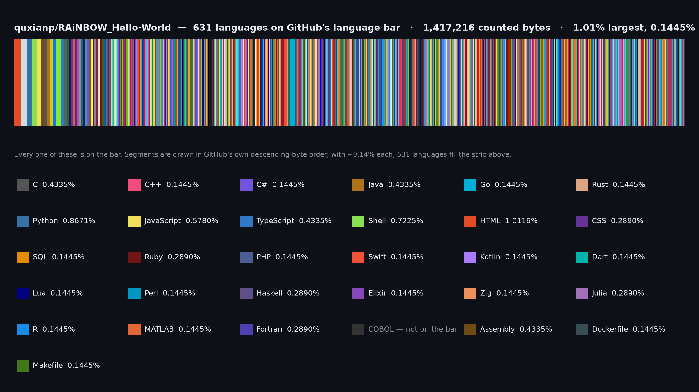

# RAiNBOW_Hello-World

> **Hello World, in 3000+ languages — and a GitHub language bar that is a rainbow.**

GitHub colours every repository by the byte share of each language it detects.
This repository is built around one idea: put **every single language GitHub
Linguist knows how to colour** into the bar, give each of them an *identical*
slice of the pie, and order them by hue. The result is the densest, most
continuous language bar on GitHub — hundreds of hair-thin segments sweeping
through red, orange, amber, yellow, chartreuse, green, cyan, azure, blue,
violet, magenta and back to red.

| | |
|---|---|
| Core layer (`hello/core/`) | **694** languages — every Linguist-coloured language that can be detected |
| Full layer (`hello/full/`) | **6 632** files — the long tail of every language we could find |
| Total language files | **7 326** |
| Merged inventory | **7 325** unique language records |
| Byte share per core language | **0.144092 %** (exactly equal for all 694) |
| Share sum | **100.000000 %** |

Everything heavy — compiling, running, recording, screenshotting and committing
the demo assets back into this repository — happens in **GitHub Actions**, not
on your machine.

---

<!-- RAINBOW_ASSETS_START -->

## 🎬 The show




[⬇↓ Download the MP4](assets/hello-world.mp4)

> The three assets above are produced by `.github/workflows/rainbow.yml` on every
> push to `main`. Until the first successful run, they may not exist yet — see
> [Regenerating the assets](#regenerating-the-assets).

<!-- RAINBOW_ASSETS_END -->

---

## How the rainbow is engineered

### 1. Two layers, because Linguist is the ceiling

GitHub's language bar can only show languages Linguist detects. There are 836
Linguist languages and **694 of them carry a colour**. That is a hard ceiling for
the bar, so the repository uses two layers:

| Layer | Path | Count | Vendored? | On the bar? |
|---|---|---|---|---|
| Core | `hello/core/` | 694 | no | **yes** |
| Full | `hello/full/` | 6 632 | yes | no |

`hello/full/` is fully real — every file is committed, readable and valid — it is
simply marked `linguist-vendored` so it does not dilute the bar.

### 2. `.gitattributes` steers Linguist

```gitattributes
* -text linguist-vendored
/hello/core/** -linguist-vendored
/hello/core/** linguist-detectable
/hello/full/** linguist-vendored
README.md linguist-documentation
scripts/** linguist-documentation
```

The `linguist-detectable` line matters more than it looks. Linguist only counts
`programming` and `markup` types in the statistics by default, and **124 of the
694 core languages are `data` or `prose`** (Markdown, JSON, SQL, CSV, TOML,
AsciiDoc, …). Without that attribute two thirds of them would silently vanish
from the bar. Everything outside `hello/core/` — the scripts, configs, data
dumps and logs that drive the whole thing — is documentation, so it never
competes for a single byte of the bar.

### 3. Equal byte shares → equal, visible segments

Linguist draws each language's width from its share of the *counted* bytes. If
files kept their natural sizes, a 40 KB template would dwarf a 200 B Brainfuck
snippet and the rainbow would collapse into a few fat blobs.

So `scripts/balance_bytes.py` pads **every** core file to exactly **2048 bytes**
using that language's own comment syntax (`//`, `#`, `--`, `%`, `;`, `(* *)`,
`<!-- -->`, …), or trailing whitespace where no comment exists. With 694 files
that is 694 × 2048 = **1 421 312 bytes**, so every language gets precisely
`100 / 694 = 0.144092 %`. The result is inside the 0.05 %–0.5 % visibility
window, the standard deviation is **0.000000 pp**, and the sum is exactly 100 %.

The padding is idempotent — re-running the balancer produces a zero-byte diff.

### 4. Hue-ordered colour wheel

Core languages are sorted by the HSL hue of their Linguist colour, so the bar
reads as a continuous sweep instead of a random confetti. The 694 segments
distribute across the wheel like this:

| Bucket | Langs | | Bucket | Langs | | Bucket | Langs | | Bucket | Langs |
|---|---|---|---|---|---|---|---|---|---|
| red-orange | 80 | | spring-green | 35 | | cyan | 29 | | violet | 28 |
| orange | 35 | | green-cyan | 30 | | cyan-blue | 59 | | purple | 33 |
| amber | 49 | | azure | 96 | | blue | 57 | | magenta | 12 |
| yellow | 27 | | yellow-green | 26 | | pink | 17 | | rose | 20 |
| green | 25 | | | | | | | | red | 36 |

Hue span measured end to end: **0.0° → 359.6°**, no gaps.

### 5. Measured, not predicted

The numbers GitHub itself reports for this repository:

| Measured from `GET /repos/quxianp/RAiNBOW_Hello-World/languages` | Value |
|---|---|
| Languages on the bar | **631** |
| Counted bytes | 1 417 216 |
| Entries that are not an exact multiple of 2048 | **0** |
| Smallest share | 0.144509 % (`1C Enterprise`) |
| Largest share | 1.011561 % (`HTML` — 7 HTML dialect files) |
| Average segment width at 1200 px | **1.90 px** |

That 631 is GitHub's canonical form of the 694 configured core languages: some
names are folded by Linguist (`Vim script` → `Vim Script`, `KoLmafia ASH` →
`KoLMafia ASH`) and a handful of dialects are not counted at all
(`HTML+ERB`, `HTML+PHP`, `Julia REPL`, `Python console`, …). Both 631 and 694
sit inside the 600–800 target.

The "0 exceptions" row is the load-bearing one: if a single counted byte were
not a multiple of 2048, then something outside `hello/core/` was leaking into
the bar. Nothing is — `hello/full/`, `scripts/`, `config/`, `data/` and this
README are all correctly excluded.

---

## Where the 7 325 languages came from

Languages were harvested from several independent sources and merged on a
lowercased name key. Counts below are **raw mentions** (how often a name was
seen); after de-duplication across all sources the inventory holds **7 325**
unique records.

| Source | Mentions | What it contributes |
|---|---|---|
| Wikipedia (lists, categories) | 3 658 | the broad mainstream long tail |
| esolangs.org | 3 307 | esoteric languages, in depth |
| GitHub Linguist `languages.yml` | 836 | the authoritative 694 coloured ones |
| awesome-functional-programming | 267 | FP dialects and academic offshoots |
| learn-anything | 131 | structured language taxonomy |
| free-programming-books | 123 | further niche entries |
| TIOBE Index | 73 | popularity-ranked mainstream languages |
| GitHub topic `programming-language` | 51 | active ecosystem languages |
| GitHub topic `language` | 49 | ditto |
| GitHub topic `esoteric-language` | 47 | more esolangs |
| GitHub collection `programming-languages` | 36 | curated set |
| IEEE Spectrum Top Languages | 7 | industry-representative set |
| Built-in fallback groups (21 of them) | 1 725 | ancient, assembly dialects, binary data formats, blockchain, quantum, HDL, golf, DSL/query, templates, education, Chinese-language listings |
| Rosetta Code | 0 | fetched, but every entry was already covered by another source |

The built-in fallback groups matter: they guarantee that famous families are
never missing just because a scrape failed. Rosetta Code is listed because it was
attempted, not because it added anything — after de-duplication it contributed
no name the other sources had not already produced.

- Full merged inventory: [`config/all-langs.json`](config/all-langs.json)
- Core list (the ones on the bar): [`config/core-langs.txt`](config/core-langs.txt)
- Per-file manifest: [`hello/manifest.json`](hello/manifest.json)

---

## Running it

### Locally

```bash
./install_deps.sh      # optional: figlet, toilet, lolcat, ffmpeg, ...
./run.sh              # the show
```

```bash
./run.sh --quiet        # skip the opening animation
./run.sh --jobs 16      # more parallelism
./run.sh --max 200      # print 200 language names in the roll call
NO_COLOR=1 ./run.sh     # plain text, no SGR escapes
```

`run.sh` never aborts on a missing dependency. It:

1. detects `figlet` / `toilet` / `lolcat`, falling back to `scripts/rainbow.py`;
2. sweeps the word `RAiNBOW_Hello-World` through the hue wheel;
3. rolls the 694 core languages past (`✓` marks, then `+644 more`);
4. executes every language it can actually run, in parallel
   (`scripts/run_languages.py`, TSV results in `logs/output/results.tsv`);
5. renders **Hello World!** as ASCII art coloured character-by-character with 24-bit
   true colour;
6. beeps — `afplay` / `aplay` / `paplay` if present, otherwise `printf '\a'`;
7. shows an easter egg of esoteric languages from `hello/full/`;
8. draws the 694-segment bar and prints the final true-colour **Hello World!**.

Progress is written to `logs/run.log`.

### In GitHub Actions (the supported path)

Everything is compiled, executed and recorded in the cloud:

| Job | What it does |
|---|---|
| `verify` | runs `verify_languages.py` (19 acceptance checks) and the Linguist simulation |
| `batches` | 24-way matrix; regenerates and rebalances its shard of `hello/core/`, commits only on drift |
| `assets` | runs `run.sh`, records it with VHS → GIF, transcodes MP4 with ffmpeg, renders the local bar, screenshots the real bar with Playwright, rewrites the asset block in this README, and commits back |

Trigger it by hand:

```bash
gh workflow run rainbow.yml            # or: Actions ▸ rainbow ▸ Run workflow
```

The bot's own commits carry `[skip ci]` so publishing assets can never trigger
an infinite loop. If branch protection blocks `GITHUB_TOKEN`, set the
`GH_PAT` secret and the workflow falls back to it; if that is missing too, the
assets are uploaded as a workflow artifact and the exact manual push commands
are printed in the job summary.

### Regenerating the assets

```bash
python scripts/fetch_languages.py          # refresh data/*.json from the network
python scripts/merge_language_sources.py   # dedupe -> config/
python scripts/generate_all_hello.py       # write hello/core + hello/full
python scripts/balance_bytes.py            # equalise byte shares
python scripts/verify_languages.py         # 19 acceptance checks
python scripts/generate_rainbow_bar.py     # assets/rainbow-bar-local.{png,svg}
bash scripts/record_demo.sh                # assets/hello-world.{gif,mp4}
python scripts/screenshot_github.py        # assets/rainbow-bar-github.png
```

`--shard i/n` on `generate_all_hello.py` and `balance_bytes.py` processes only
one slice, which is how the matrix job splits the work.

---

## Acceptance checks

`scripts/verify_languages.py` is the gate. Current state — **19/19 pass**:

| Check | Result |
|---|---|
| Core languages within 600–800 | 694 |
| Core == every detectable Linguist-coloured language | 694 / 694, 0 deferred |
| Every core file exists | 0 missing |
| Core share inside 0.05 %–0.5 % | min 0.1441 %, max 0.1441 % |
| Shares sum to 100 % | 100.000000 % |
| Share spread tight | stdev 0.000000 pp |
| Counted bytes non-trivial | 1 421 312 B |
| Full layer ≥ 2 400 files | 6 632 |
| Total language files ≥ 3 000 | 7 326 |
| `.gitattributes` un-vendors `hello/core` | ok |
| `.gitattributes` vendors `hello/full` | ok |
| `.gitattributes` marks README as documentation | ok |
| `.gitattributes` default is vendored | ok |
| Every core file recognisable by Linguist | 0 unrecognisable |
| Colour wheel fully covered | no missing buckets |
| Hues span the wheel | 0.0° → 359.6° |
| Languages ordered by hue | ok |
| `hello/manifest.json` exists | ok |
| Merged inventory ≥ 3 000 | 7 325 |

`logs/verify_languages.json`, `logs/balance_report.txt` and `logs/balance_summary.json`
hold the machine-readable results.

---

## Layout

```
.gitattributes          Linguist steering -- this is what makes the bar a rainbow
.github/workflows/     rainbow.yml: verify + 24 shards + assets
config/                rainbow_langs.json, core-langs.txt, all-langs.json
data/                  raw + merged language inventories from every source
hello/core/            694 byte-balanced files -- the rainbow bar
hello/full/            6 632 files -- the long tail, vendored
hello/manifest.json    per-language file, extension, colour, interpreter, runnable flag
scripts/               fetch, merge, select, generate, balance, verify, render, record
assets/                rainbow-bar-local.{png,svg}, rainbow-wheel.png, demo gif/mp4
logs/                  every run, balance report and agent ledger
run.sh                 the show
install_deps.sh        optional dependencies, all optional
demo.tape              VHS recording configuration
```

---

## Dependencies and fallbacks

| Wants | Uses | If missing |
|---|---|---|
| `figlet` / `toilet` | ASCII banner | `scripts/rainbow.py` built-in art |
| `lolcat` | colour pipeline | `scripts/rainbow.py` 24-bit SGR |
| GNU `parallel` | parallel execution | `scripts/run_languages.py` thread pool |
| `github-linguist` | authoritative stats | pure-Python simulator |
| `ffmpeg` | GIF → MP4 | GIF only, MP4 skipped |
| `vhs` | terminal recording | skipped, GIF/MP4 not refreshed |
| Playwright | bar screenshot | skipped, local PNG used instead |
| `afplay`/`aplay`/`paplay` | sound | `printf '\a'` |

Nothing above is required for the acceptance checks, and `run.sh` always ends
with a true-colour **Hello World!** no matter what is installed.

---

## Acknowledgements

- **[GitHub Linguist](https://github.com/github/linguist)** — the language
  definitions and colours everything here is built on.
- **[lolcat](https://github.com/jaseg/lolcat)** — the inspiration for the
  terminal rainbow.
- **[figlet](https://www.figlet.org/)** and
  **[toilet](https://github.com/potato-42/toilet)** — ASCII art.
- **[chrisnager/pride](https://github.com/chrisnager/pride)** — for showing that
  language bars can be art.
- **[VHS](https://github.com/charmbracelet/vhs)** — terminal recording.
- **[Playwright](https://playwright.dev/)** — the real language-bar screenshot.
- **[esolangs.org](https://esolangs.org/)** — the esoteric language catalogue.
- **[Rosetta Code](https://rosettacode.org/wiki/Category:Programming_Languages)** —
  multi-language task corpus.
- **[Wikipedia](https://en.wikipedia.org/wiki/List_of_programming_languages)** —
  the broad inventory.
- Everyone who files a Linguist PR adding a colour to a language.

## License

[MIT](LICENSE) © RAiNBOW Bot
